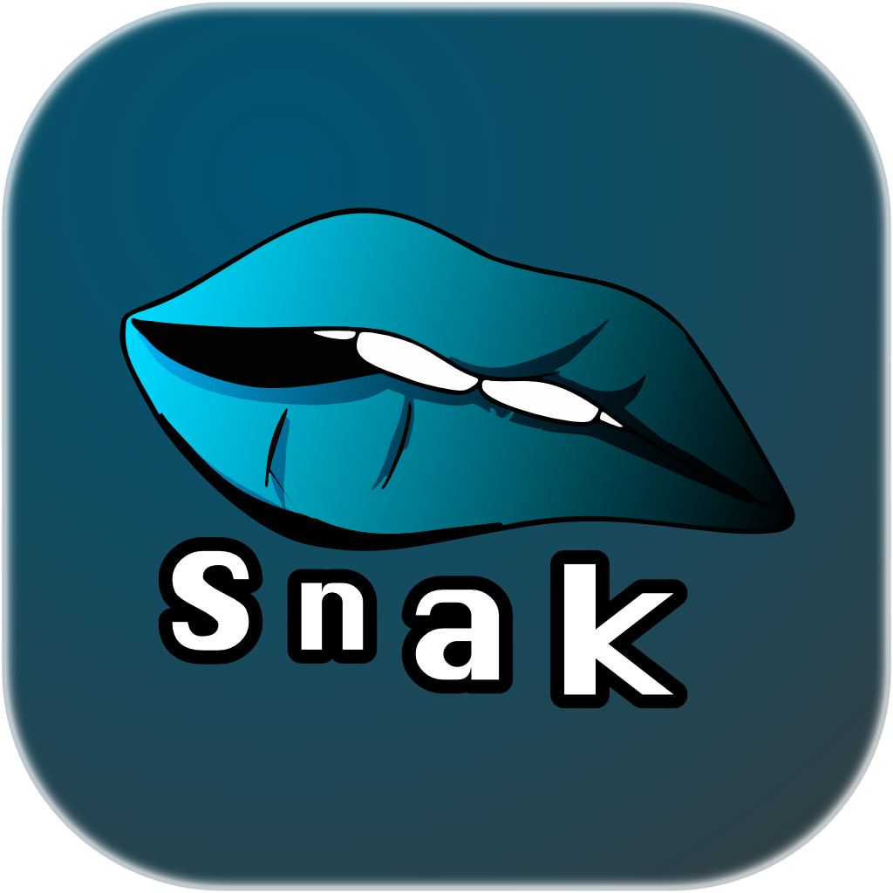

<div align="center">



# snak

**A fast, private, multi-provider LLM chat app for your desktop.**

Bring your own keys. Talk to Claude, GPT, Gemini, Mistral, or local models — all from one
keyboard shortcut, with your history living on your machine, not someone's cloud.

<sub>*snak* (Danish) — “a chat, a talk.”</sub>

<br/>

[](https://tauri.app/)
[](https://react.dev/)
[](https://www.typescriptlang.org/)
[](https://www.rust-lang.org/)
[](https://www.sqlite.org/)
[](https://tailwindcss.com/)

</div>

---

## Why snak?

Most chat front-ends ask you to trust them with your keys and your conversations. snak doesn't.
It's a native desktop app built with [Tauri](https://tauri.app/): your API keys are stored in the
**OS keychain** and never touch the web layer, and every thread is saved to a **local SQLite
database** on your machine. Outbound requests go straight from the Rust backend to each provider —
no proxy, no middleman, no telemetry.

It's also built to disappear and reappear instantly. snak lives in your **system tray** and is one
**global shortcut** away: hit the hotkey, type or paste a screenshot, and your question lands in a
fresh thread without ever breaking flow.

## Features

🤖 **Five providers, one interface** — Anthropic (Claude), OpenAI (GPT), Google Gemini, Mistral,
and local models via **Ollama**. Switch model per-thread from a single picker.

🔑 **Bring your own key, kept safe** — keys live in the native OS keychain (macOS Keychain /
Windows Credential Manager / Linux Secret Service). The webview never sees them.

💬 **Multi-thread chat with local history** — unlimited concurrent conversations, persisted to
on-device SQLite. Rename, search, and pick up any thread where you left off.

🖼️ **Multimodal & documents** — drag, paste, or pick images, and attach PDFs, Word/Pages,
PowerPoint, Excel, ODF and code files — they're parsed to text and folded into the conversation.

⚡ **Quick-input overlay + global shortcut** — summon a frameless capture window from anywhere
(default <kbd>Alt</kbd>+<kbd>Space</kbd>) to start a chat without leaving what you're doing.

📸 **Screenshot to chat** — grab an interactive region of your screen and send it straight to the
model as a question.

🎭 **Personas / bots** — named characters with their own avatar, personality, and per-bot memory.
`@`-mention any persona in a thread for a one-shot, in-character reply.

🕶️ **Incognito chats** — conversations that leave no trace and are purged when the app closes,
with a clear visual identity so you always know which mode you're in.

🔬 **Deep research mode** — turn it on for a hard question and snak dispatches parallel research
sub-agents to gather and synthesize information, keeping the main thread's context clean.

🌍 **Localized & tunable** — bundled language packs (English, German, French, Polish, Spanish,
Danish) plus configurable UI/chat fonts, sizes, layouts, and accent colors.

🧩 **Plugin system** — providers, themes, slash-commands, and renderers are declarative,
sandboxed plugins. Built-ins include `/terminal` (staged, never auto-run), **Mermaid** diagrams,
**Vega** charts, **YouTube** embeds, and **multi-file artifacts** with live preview and an AI editor.

🎨 **Polished theming** — light / dark / system themes, custom accent colors, and a clean
shadcn/ui interface that follows your OS.

🛟 **Streams everything** — all providers stream token-by-token over a native channel, so replies
appear as they're generated.

## Providers

| Provider | Models | Notes |
| --- | --- | --- |
| **Anthropic** | Claude family | Native system prompt + streaming |
| **OpenAI** | GPT family | OpenAI-compatible chat completions |
| **Mistral** | Mistral family | OpenAI-compatible |
| **Google Gemini** | Gemini family | SSE streaming |
| **Ollama** | Any local model | Keyless — runs entirely on your machine |

<!--
## Screenshots

Add a few screenshots or a short GIF here — e.g. the chat view, the quick-input overlay,
and an artifact preview. Drop them under `graphics/` and reference them like:


-->

## Tech stack

- **Shell:** [Tauri v2](https://tauri.app/) (Rust) — windowing, tray, global shortcut, keychain, SQLite, screenshots
- **Frontend:** [React 19](https://react.dev/) + [TypeScript](https://www.typescriptlang.org/) + [Vite](https://vite.dev/)
- **UI:** [Tailwind CSS v4](https://tailwindcss.com/) + [shadcn/ui](https://ui.shadcn.com/) + [Zustand](https://zustand-demo.pmnd.rs/) for state
- **Backend:** Rust with `reqwest` for provider HTTP, `tauri-plugin-sql` (SQLite), and the `keyring` crate
- **Platforms:** Linux, macOS, and Windows. Primary target is Linux (KDE).

## Getting started

You'll need **Node.js 20+** with npm and **Rust** (via [rustup](https://rustup.rs/)). The rest of
the toolchain is platform-specific — follow the section for your OS, then jump to [Run it](#run-it).

### macOS

```bash
# Xcode Command Line Tools (provides the C toolchain Tauri/Rust need)
xcode-select --install

# Rust + Node (Homebrew shown; rustup/nvm work too)
brew install rustup-init node
rustup-init -y
```

That's it — macOS needs no extra system libraries for Tauri.

> On first launch snak may ask for **Screen Recording** permission (System Settings → Privacy &
> Security) so the screenshot-to-chat feature can capture your screen.

### Linux

snak targets KDE but runs on any modern desktop. Install Rust via [rustup](https://rustup.rs/), then
the [Tauri v2 system dependencies](https://tauri.app/start/prerequisites/#linux) for your distro:

```bash
# Debian / Ubuntu
sudo apt update && sudo apt install -y \
  libwebkit2gtk-4.1-dev build-essential curl wget file \
  libxdo-dev libssl-dev libayatana-appindicator3-dev librsvg2-dev

# Arch / KDE
sudo pacman -S --needed \
  webkit2gtk-4.1 base-devel curl wget file openssl \
  libappindicator-gtk3 librsvg
```

**Optional — inline media playback.** YouTube embeds and other in-app media use WebKitGTK's
GStreamer backend. Without these, snak degrades gracefully and opens videos in your browser:

```bash
# Arch
sudo pacman -S gst-plugins-good gst-plugins-bad gst-plugins-ugly gst-libav
# Debian / Ubuntu
sudo apt install gstreamer1.0-plugins-good gstreamer1.0-plugins-bad gstreamer1.0-plugins-ugly gstreamer1.0-libav
```

### Run it

```bash
npm install        # install frontend dependencies
npm run tauri dev  # build the Rust backend + serve Vite, then open the app
```

Open **Settings → API Keys** and paste a key for any provider you want to use, then start chatting.
(Prefer local models? See [Local models with Ollama](#local-models-with-ollama) — no key required.)

### Build a release

```bash
npm run tauri build
```

This produces native installers/bundles for your platform under
`src-tauri/target/release/bundle/` — `.dmg`/`.app` on macOS, `.deb`/`.rpm`/`.AppImage` on Linux.

> **Linux build note:** on some distros the AppImage step needs `NO_STRIP=true npm run tauri build`
> — linuxdeploy's bundled `strip` can't read modern `.relr.dyn` ELF sections.

### Releasing (CI builds for all platforms)

Pushing a version tag builds installers for **Linux, macOS and Windows** on GitHub Actions
(`.github/workflows/release.yml`) and attaches them to a published GitHub Release.

1. Bump the version to the same `X.Y.Z` in **all three** files: `package.json`,
   `src-tauri/Cargo.toml`, and `src-tauri/tauri.conf.json`. (CI fails fast if the tag and
   `tauri.conf.json` disagree.)
2. Commit, then tag and push:

   ```bash
   git tag vX.Y.Z
   git push origin vX.Y.Z
   ```

3. CI builds the three platforms in parallel and **auto-publishes** the release once all
   succeed — a universal `.dmg` (macOS), `.exe` + `.msi` (Windows), and `.deb`/`.rpm`/`.AppImage`
   (Linux). No secrets are required.

> **Unsigned builds:** the installers are not yet code-signed, so the OS shows a one-time
> warning. On **macOS**, right-click the app → **Open** (or
> `xattr -dr com.apple.quarantine /Applications/snak.app`). On **Windows**, click
> **More info → Run anyway** on the SmartScreen prompt. Real signing/notarization can be
> added later alongside the in-app updater.

### Local models with Ollama

snak speaks to a local [Ollama](https://ollama.com/) server, so you can run models entirely
on-device with **no API key and no data leaving your machine**.

1. **Install & start Ollama** — [download it](https://ollama.com/download), or `brew install ollama`
   on macOS. It runs a local server at `http://localhost:11434`.
2. **Pull a model.** For lower-spec systems we recommend **`gemma4:e4b`** — Google's "effective 4B"
   edge model: multimodal, a 128K context, ~9.6 GB to download, and comfortable on a machine with
   ~8 GB+ of free RAM. On leaner hardware, drop to **`gemma4:e2b`** (~7.2 GB).

   ```bash
   ollama pull gemma4:e4b   # recommended for most laptops / lower-spec systems
   # ollama pull gemma4:e2b # lighter alternative for tighter RAM
   ```
3. **Use it in snak** — pick **Ollama** in the model picker and select your pulled model. No key
   needed; just keep the Ollama server running.

## Project layout

```
src/            React app — chat UI, threads, settings, plugins (frontend)
src-tauri/      Rust backend — providers, keychain, DB, tray, global shortcut
  ├─ src/providers/   one module per LLM provider (streaming over a channel)
  ├─ src/commands/    Tauri commands exposed to the webview
  └─ migrations/      SQLite schema migrations
graphics/       logo & brand assets
docs/           design notes (theming, i18n, plugin foundation)
```

The split is deliberate: anything touching the OS, the filesystem/database, or secret keys lives
in the Rust backend and is invoked from React over Tauri's command bridge. The webview owns the UI
and the chat history; the backend owns the native concerns and the outbound API calls.

## Contributing

Issues and pull requests are welcome. Before opening a PR, please make sure things are clean:

```bash
npm run lint          # ESLint
npm run format:check  # Prettier
npm run build         # typecheck + Vite build
npm run test          # Vitest
(cd src-tauri && cargo clippy && cargo fmt --check)
```

## License

Not yet specified — please open an issue if you'd like to use snak in your own project.
